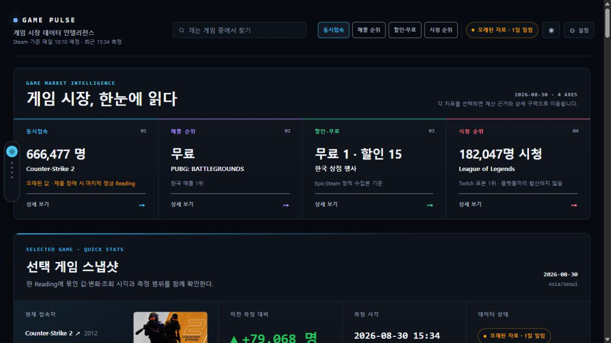

<div align="center">

# GAME PULSE

### 게임 시장을 네 가지 신호로 읽는 데이터 인텔리전스 보드

Steam 동시접속자 · 한국 매출 · 할인/무료 배포 · 게임 방송을 한 화면에서 연결하고,<br>
숫자마다 **출처·측정 시각·데이터 상태·계산 근거**를 함께 보여줍니다.

[](https://myeongjundev.github.io/info-board/)
[](docs/VERIFY.md)
[](https://github.com/myeongjundev/info-board/actions/workflows/ci.yml)


<br>

[**▶ 설치 없이 바로 보기**](https://myeongjundev.github.io/info-board/) ·
[**✓ 30초 검증 안내서**](docs/VERIFY.md) ·
[**↗ 실제 기록 데이터**](data/records.json)

</div>



---

## 30초 안에 확인하기

설치도 로그인도 필요 없습니다.

| 순서 | 무엇을 하나요 | 무엇이 보이면 통과인가요 |
|---:|---|---|
| 1 | [공개 화면](https://myeongjundev.github.io/info-board/)을 연다 | 네 가지 시장 신호와 측정 시각이 보인다 |
| 2 | `Steam · 동시접속자 ↗`를 누른다 | 인증 없이 Steam 원자료 JSON이 열린다 |
| 3 | 화면 아래 `장애 재현`에서 `offline`을 누른다 | 마지막 정상값은 남고, `오래된 자료`와 실패 이유가 표시된다 |

자세한 통과 기준과 문제 해결 방법은 [검증 안내서](docs/VERIFY.md)에 정리했습니다.

## 네 가지 질문으로 읽습니다

| 질문 | 화면이 보여주는 것 | 수집 주기 | 데이터 상태 |
|---|---|---:|---|
| **얼마나 하나** | Steam 게임별 동시접속자 | 매일 10:10 KST 부근 | 측정 시각이 있는 순간값 |
| **뭐가 팔리나** | 한국 Steam 매출 순위 | 매시간 | 공식 판매 차트 스냅샷 |
| **뭐가 싸나** | Epic 무료 배포와 Steam 할인 | 매시간 | 종료 시각이 있는 프로모션 |
| **뭘 보나** | 치지직·Twitch 게임 방송 Top 10 | 매시간 | 플랫폼별 표본을 분리 표시 |

첫 화면에서 대표값을 비교하고, 각 항목의 `상세 보기`에서 순위·변화·시간 편향과
근거를 더 깊게 확인할 수 있습니다.

<details>
<summary><b>동시접속 기록으로 만든 다섯 가지 분석</b></summary>

- ⏰ **같은 날, 다른 시각** — 순간값이 측정 시각에 따라 얼마나 달라지는지 보여줍니다.
- 🎮 **장르로 묶어 보기** — 직접 붙인 장르 분류와 포함된 게임 수를 함께 공개합니다.
- 🏆 **오늘 잰 것** — 같은 배치에서 측정한 게임을 접속자 순으로 정렬합니다.
- 🚀 **이전 측정 대비 움직임** — 동일 게임의 이전 기록과 현재 기록을 비교합니다.
- 💀 **아직 살아 있는가** — 출시된 지 오래된 게임의 현재 접속자를 따로 읽습니다.

</details>

## 숫자보다 먼저, 숫자를 믿을 근거를 보여줍니다

값 하나를 크게 띄우는 것은 쉽습니다. GAME PULSE는 그 값이 **언제, 어디서,
어떤 상태로 왔는지**를 숨기지 않는 데 더 많은 비중을 둡니다.

| 원칙 | 화면에서 확인할 수 있는 것 |
|---|---|
| 측정일과 조회 시각을 섞지 않는다 | `잰 날`과 `잰 시각`을 서로 다른 칸에 표시 |
| 오래된 값에 현재 시각을 붙이지 않는다 | 수집 실패 시 마지막 정상값과 원래 측정 시각 유지 |
| 모르는 값을 만들지 않는다 | 정상값이 한 번도 없으면 숫자 대신 `—` 표시 |
| 실패를 하나로 뭉개지 않는다 | timeout · 인증 실패 · 호출 제한 · 오프라인 · 형식 변경 구분 |
| 계산을 검산할 수 있게 한다 | 이전값·현재값·차이·단위와 손계산 식 표시 |
| 원자료의 한계를 공개한다 | 원자료·저장값·계산값·화면값을 한 자리에서 대조 |

### 원자료 숫자와 화면 숫자가 다른 이유

Steam 동시접속자는 **호출하는 순간의 사람 수**입니다. 확정된 하루치 통계가 아니므로,
화면에 저장된 측정값과 지금 다시 연 원자료의 값은 달라질 수 있습니다.

| 시각 (UTC) | 실제 측정값 |
|---|---:|
| 00:04 | 572,811 |
| 00:59 | 551,673 ← 저장된 값 |
| 01:27 | 537,072 |

이 차이를 결함처럼 감추지 않고 화면에 설명합니다. 순간값은 과거로 돌아가 다시 잴 수
없기 때문에, 수집기는 오늘이 아닌 날짜를 **외부 호출 전에 거부**합니다.

## 장애가 나도 기록을 거짓으로 만들지 않습니다

공개 화면의 `장애 재현`에서 다섯 상태를 직접 확인할 수 있습니다.

| 재현 상태 | 사용자에게 보이는 설명 | 마지막 정상값 |
|---|---|---|
| `timeout` | 응답이 오지 않았다 | 유지 |
| `auth` | 접근이 거부됐다 | 유지 |
| `rate-limit` | 호출 제한에 걸렸다 | 유지 |
| `offline` | 연결이 끊겼다 | 유지 |
| `schema` | 응답 형식이 달라졌다 | 유지 |

`정상으로`를 누르면 원래 화면으로 돌아옵니다. 마지막 정상값도 없는 경우에는 값을
추측하지 않고 `—`로 표시합니다.

## 데이터가 화면까지 오는 길

```text
공개 원자료
   │
   ▼
GitHub Actions 수집기 ── 중복·날짜·응답 형식 검사
   │
   ▼
data/*.json 커밋 ─────── Git 이력이 감사 로그 역할
   │
   ▼
테스트 + T04 조건 감사 ─ 실패하면 배포 중단
   │
   ▼
GitHub Pages ─────────── 브라우저가 같은 기록 파일을 읽음
```

Steam은 브라우저의 직접 호출을 허용하지 않으므로 화면에서 `LIVE`라고 부르지 않습니다.
방문자가 보는 것은 저장소에 커밋된 가장 최근 스냅샷이며, 신선도는 측정 시각을 기준으로
판정합니다.

## 출처와 공개 범위

동시접속 핵심 기록은 인증 키가 필요 없는 공식 Steam Web API를 사용합니다.

```http
GET https://api.steampowered.com/ISteamUserStats/GetNumberOfCurrentPlayers/v1/?appid=730
→ {"response":{"player_count":551673,"result":1}}
```

- 동시접속자: [Steam Web API](https://partner.steamgames.com/doc/webapi/ISteamUserStats)
- 게임 이름과 장르: 원자료가 제공하지 않아 저장소에서 명시적으로 관리
- 표지 이미지: 값과 분리된 Steam CDN 자산이며 실패하면 조용히 숨김
- 할인 일부: 비공식 Steam Store 응답을 사용하며 화면과 [작업 규칙](CLAUDE.md)에 예외를 명시
- 치지직·Twitch 수집 자격증명: GitHub Actions의 암호화된 Secrets로만 사용

**공개 저장소·배포 파일·Git 이력에 비밀 원문은 0건입니다.** 검사 범위와 결과는
[대조표 5절](docs/CROSSCHECK.md#5-비밀값-0건)에서 확인할 수 있습니다.

## 로컬에서 실행하기

Node.js 22 이상을 사용합니다.

```bash
git clone https://github.com/myeongjundev/info-board.git
cd info-board
npm install
npm run dev
```

```bash
npm test                         # 전체 회귀 테스트
npm run audit:t04                # T04 조건 35개 판정 경로 확인
npm run audit:t04 -- --online    # 공개 화면·소스·동적 원천 접근까지 확인
npm run build                    # 배포 산출물 생성
```

수집기는 별도 런타임 의존성 없이 실행할 수 있습니다.

```bash
node scripts/collect.mjs
```

오늘 기록이 이미 있다면 외부 API를 다시 호출하지 않고 종료합니다.

## 프로젝트 구조

```text
src/source/   출처 adapter와 외부 응답 정규화
src/state/    날짜+신호 키, 저장 상태, 손상 데이터 격리
src/view/     변화량·방향·경과시간 등 브라우저 없는 화면 계산
src/ui/       React 화면과 장애 재현 UI
scripts/      수집·마이그레이션·검증·T04 감사
data/         화면이 읽는 일별 기록과 분리된 확장 스냅샷
assets/       T04 조건 정본과 공개 fixture
```

`view`와 `ui`를 나눠 변화량과 시간 계산을 DOM 없이 검증합니다. 테스트할 수 없는
자리에 계산이 있으면 원자료 → 저장값 → 계산값 → 화면값 대조가 어려워지기 때문입니다.

## 검사자를 위한 문서

| 문서 | 용도 |
|---|---|
| [검증 안내서](docs/VERIFY.md) | 공개 주소에서 30초·3단계로 통과 여부 확인 |
| [제출 PDF](output/pdf/t04-game-pulse-submission.pdf) | 검증 안내서·AI 3줄·제출 URL을 모은 A4 1페이지 요약본 |
| [대조표](docs/CROSSCHECK.md) | 원자료·저장값·계산값·화면값과 비밀값 검사 |
| [결정 기록](docs/DECISIONS.md) | 선택한 방식, 근거, 탈락시킨 후보와 현재 상태 |
| [결함 기록](docs/DEFECTS.md) | 발견한 결함과 반복 방지 방식 |
| [작업 기록](work-log/README.md) | 작업 순서와 다음 세션의 시작점 |
| [작업 규칙](CLAUDE.md) | 데이터 정직성을 위해 깨면 안 되는 규칙 |

## T04 판정 포인트

- [x] 공개 주소가 설치·로그인 없이 열린다.
- [x] 실제 동적 원천과 저장된 Reading의 연결 근거가 보인다.
- [x] 날짜·값·단위·출처·측정 시각·시간대가 함께 보인다.
- [x] 정상·실패·복구 상태를 공개 fixture로 재현할 수 있다.
- [x] 서로 다른 실제 날짜 기록과 변화량을 저장소 이력으로 확인할 수 있다.
- [x] 35개 조건에 대한 실행 가능한 감사 경로가 있다.
- [x] 개인정보와 공개된 비밀 원문이 없다.

---

<div align="center">

**SKT ALEPH T04 · 오늘의 진짜 정보판 — 데이터가 안 올 때**

숫자를 보여주는 대시보드가 아니라,<br>
**그 숫자를 어디까지 믿어도 되는지 보여주는 정보판**입니다.

</div>
